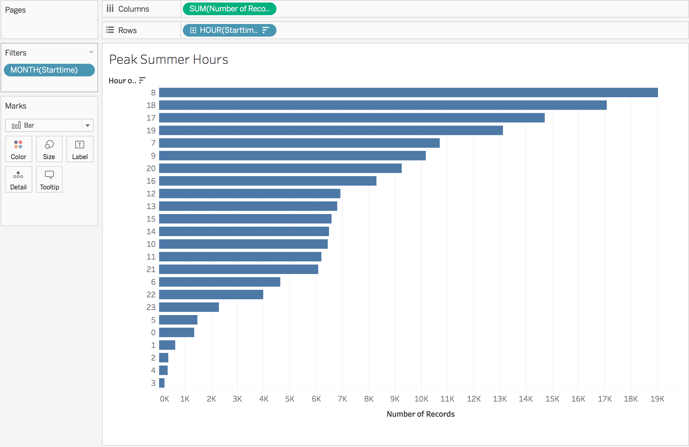
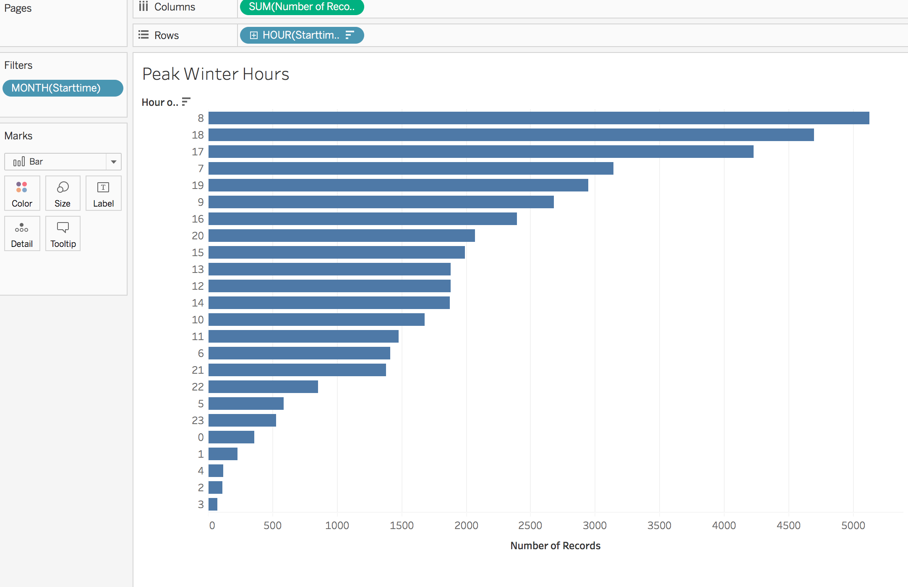

# Tableau Assignment - Citi Bike Analytics

## Background

Congratulations on your new job! As the new lead analyst for the [New York Citi Bike](https://en.wikipedia.org/wiki/Citi_Bike) Program, you are now responsible for overseeing the largest bike sharing program in the United States. In your new role, you will be expected to generate regular reports for city officials looking to publicize and improve the city program.

Since 2013, the Citi Bike Program has implemented a robust infrastructure for collecting data on the program's utilization. Through the team's efforts, each month bike data is collected, organized, and made public on the [Citi Bike Data](https://www.citibikenyc.com/system-data) webpage.

However, while the data has been regularly updated, the team has yet to implement a dashboard or sophisticated reporting process. City officials have a number of questions on the program, so your first task on the job is to build a set of data reports to provide the answers. 

# Peak Summer/Winter Hours - Citi Bike Analytics
The peak hours for summer months are the mornings and the evenings such as 7 am, 8 am and 9 am. The peak hours for the winter months are mostly the evening hours such as 6 pm, 7 pm, and 9 pm. Overall, it appears that the most popular times to ride a bike is during the evening or morning. This may be due to commuting times. 

**Additionally, city officials would like to see the following visualizations:**

* A static map that plots all bike stations with a visual indication of the most popular locations to start and end a journey with zip code data overlaid on top.

* If you're working with a merged dataset: a dynamic map that shows how each station's popularity changes over time (by month and year) -- with commentary pointing to any interesting events that may be behind these phenomena.

## Assessment

Your final product will be assessed on the following metrics: 

* Analytic Rigor

* Readability

* Visual Attraction

## Copyright

Data Boot Camp (C) 2018. All Rights Reserved.
